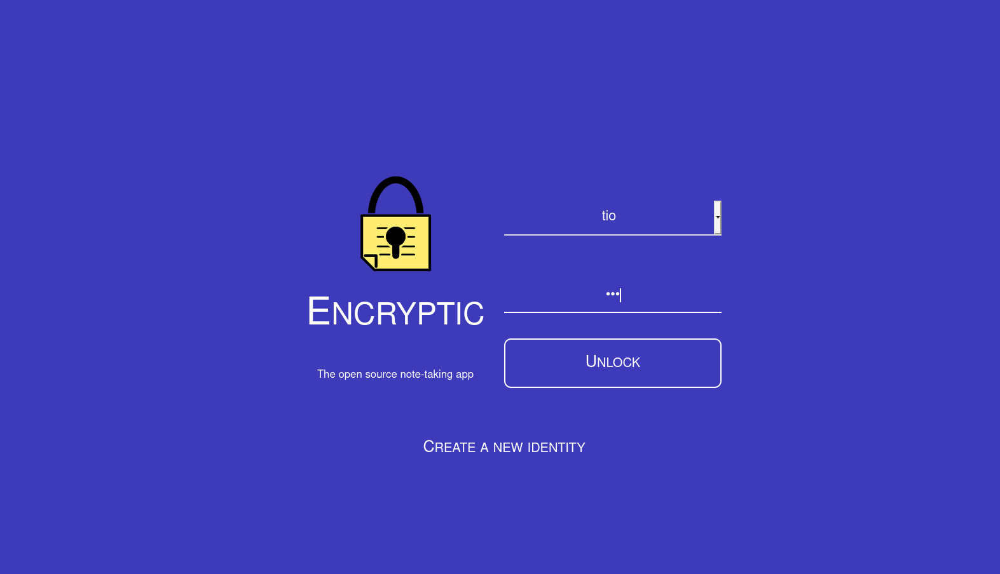

# Encryptic for YunoHost

[](https://dash.yunohost.org/appci/app/encryptic)    
[](https://install-app.yunohost.org/?app=encryptic)

*[Lire ce readme en français.](./README_fr.md)*

> *This package allows you to install Encryptic quickly and simply on a YunoHost server.  
If you don't have YunoHost, please consult [the guide](https://yunohost.org/#/install) to learn how to install it.*

## Overview
Encryptic is an anonymous system, encrypted and without registration required, it is accessible via a web browser (without software installation).
The data is private because it is stored by default on your machine (InnoDB and localstorage), it is a setting in the settings that will allow you to synchronize it via the cloud on your various devices.

**Shipped version:** 0.1.0

## Screenshots



## Demo

* [Official demo](https://app.encryptic.org/)

## Configuration

* How to configure this app: From an admin panel.

## Documentation

 * Official documentation: https://github.com/encryptic-team/encryptic/wiki
 * YunoHost documentation: If specific documentation is needed, feel free to contribute.

## YunoHost specific features

#### Multi-user support

 * Are LDAP and HTTP auth supported? **No**
 * Can the app be used by multiple users? **Yes**

#### Supported architectures

* x86-64 - [](https://ci-apps.yunohost.org/ci/apps/encryptic/)
* ARMv8-A - [](https://ci-apps-arm.yunohost.org/ci/apps/encryptic/)

## Limitations

* Any known limitations.

## Additional information

* Other info you would like to add about this app.

## Links

 * Report a bug: https://github.com/YunoHost-Apps/encryptic_ynh/issues
 * App website: https://encryptic.org/
 * Upstream app repository: https://github.com/encryptic-team/encryptic
 * YunoHost website: https://yunohost.org/

---

## Developer info

Please send your pull request to the [testing branch](https://github.com/YunoHost-Apps/encryptic_ynh/tree/testing).

To try the testing branch, please proceed like that.
```
sudo yunohost app install https://github.com/YunoHost-Apps/encryptic_ynh/tree/testing --debug
or
sudo yunohost app upgrade encryptic -u https://github.com/YunoHost-Apps/encryptic_ynh/tree/testing --debug
```
