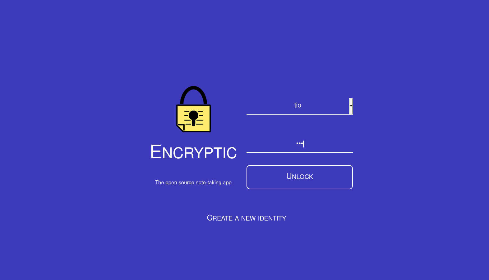

<!--
N.B.: This README was automatically generated by https://github.com/YunoHost/apps/tree/master/tools/README-generator
It shall NOT be edited by hand.
-->

# Encryptic for YunoHost

[](https://dash.yunohost.org/appci/app/encryptic)  

[](https://install-app.yunohost.org/?app=encryptic)

*[Lire ce readme en français.](./README_fr.md)*

> *This package allows you to install Encryptic quickly and simply on a YunoHost server.
If you don't have YunoHost, please consult [the guide](https://yunohost.org/#/install) to learn how to install it.*

## Overview

Encryptic (fork of Laverna) is an anonymous system, encrypted and without registration required, it is accessible via a web browser (without software installation).
The data is private because it is stored by default on your machine (InnoDB and localstorage), it is a setting in the settings that will allow you to synchronize it via the cloud on your various devices.

### Features

- Markdown editor based on Pagedown
- Synchronization with cloud storage via Dropbox or RemoteStorage
- Multiple editing modes: normal, preview, and distraction free
- Offline access to your notes
- WYSIWYG control buttons
- Syntax highlighting, MathJax support
- Robust keyboard shortcuts


**Shipped version:** 0.1.0~ynh3

**Demo:** https://app.encryptic.org/

## Screenshots



## :red_circle: Antifeatures

- **Upstream not maintained**: This software is not maintained anymore. Expect it to break down over time, be exposed to unfixed security breaches, etc.

## Documentation and resources

* Official app website: <https://www.encryptic.org/>
* Official admin documentation: <https://github.com/encryptic-team/encryptic/wiki>
* Upstream app code repository: <https://github.com/encryptic-team/encryptic>
* YunoHost documentation for this app: <https://yunohost.org/app_encryptic>
* Report a bug: <https://github.com/YunoHost-Apps/encryptic_ynh/issues>

## Developer info

Please send your pull request to the [testing branch](https://github.com/YunoHost-Apps/encryptic_ynh/tree/testing).

To try the testing branch, please proceed like that.

``` bash
sudo yunohost app install https://github.com/YunoHost-Apps/encryptic_ynh/tree/testing --debug
or
sudo yunohost app upgrade encryptic -u https://github.com/YunoHost-Apps/encryptic_ynh/tree/testing --debug
```

**More info regarding app packaging:** <https://yunohost.org/packaging_apps>
