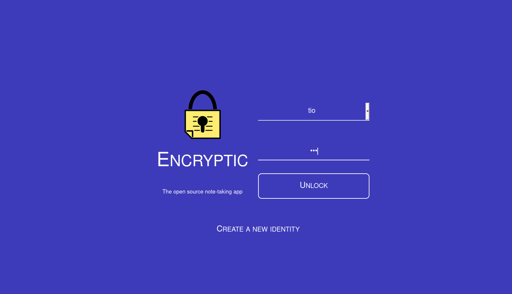

# Encryptic pour YunoHost

[](https://dash.yunohost.org/appci/app/encryptic)    
[](https://install-app.yunohost.org/?app=encryptic)

*[Read this readme in english.](./README.md)* 

> *Ce package vous permet d'installer Encryptic rapidement et simplement sur un serveur YunoHost.  
Si vous n'avez pas YunoHost, consultez [le guide](https://yunohost.org/#/install) pour apprendre comment l'installer.*

## Vue d'ensemble
Encryptic est un système anonyme, crypté et sans inscription requise, il est accessible via un navigateur web (sans installation de logiciel).
Les données sont privées, car stockées par défaut sur votre machine (InnoDB et localstorage), c’est un réglage dans les paramètres qui vous permettra de les synchroniser via le cloud sur vos différents périphériques.

**Version incluse :** 0.1.0

## Captures d'écran



## Démo

* [Démo officielle](https://app.encryptic.org/)

## Configuration

Comment configurer cette application : via le panneau d'administration, un fichier brut en SSH ou tout autre moyen.

## Documentation

 * Documentation officielle : https://github.com/encryptic-team/encryptic/wiki
 * Documentation YunoHost : Si une documentation spécifique est nécessaire, n'hésitez pas à contribuer.

## Caractéristiques spécifiques YunoHost

#### Support multi-utilisateur

* L'authentification LDAP et HTTP est-elle prise en charge ? **Non**
* L'application peut-elle être utilisée par plusieurs utilisateurs ? **Oui**

#### Architectures supportées

* x86-64 - [](https://ci-apps.yunohost.org/ci/apps/encryptic/)
* ARMv8-A - [](https://ci-apps-arm.yunohost.org/ci/apps/encryptic/)

## Limitations

* Limitations connues.

## Informations additionnelles

* Autres informations que vous souhaitez ajouter sur cette application.

## Liens

 * Signaler un bug : https://github.com/YunoHost-Apps/encryptic_ynh/issues
 * Site de l'application : https://encryptic.org/
 * Dépôt de l'application principale : https://github.com/encryptic-team/encryptic
 * Site web YunoHost : https://yunohost.org/

---

## Informations pour les développeurs

Merci de faire vos pull request sur la [branche testing](https://github.com/YunoHost-Apps/encryptic_ynh/tree/testing).

Pour essayer la branche testing, procédez comme suit.
```
sudo yunohost app install https://github.com/YunoHost-Apps/encryptic_ynh/tree/testing --debug
or
sudo yunohost app upgrade encryptic -u https://github.com/YunoHost-Apps/encryptic_ynh/tree/testing --debug
```
